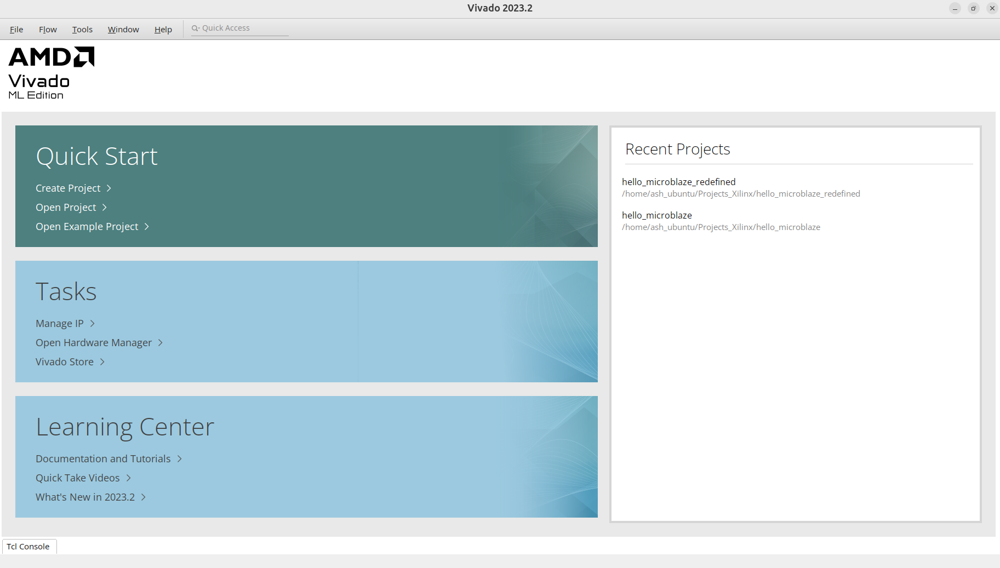
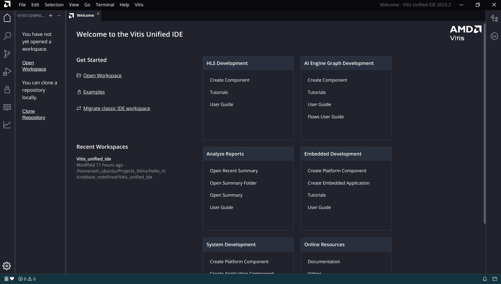
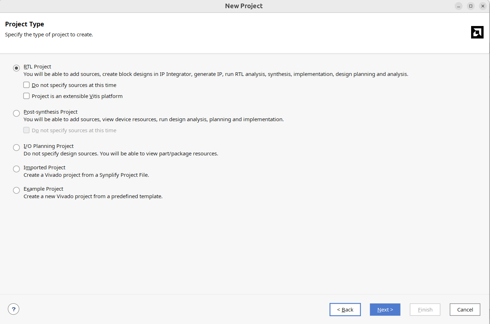
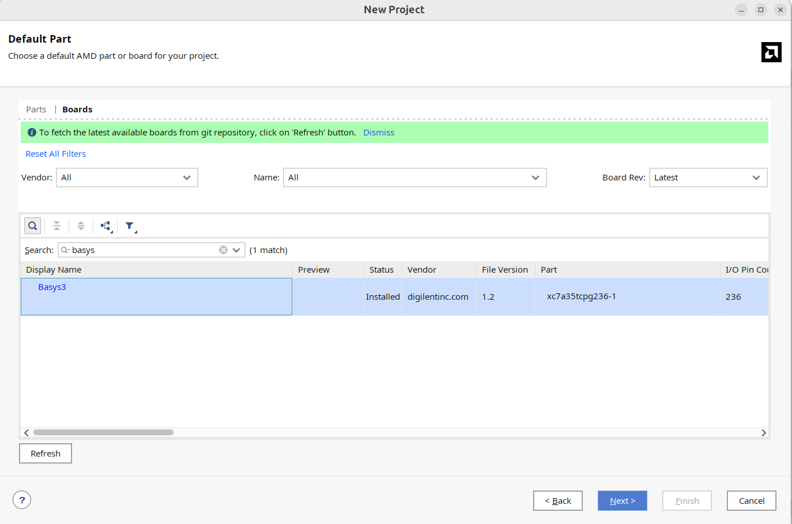
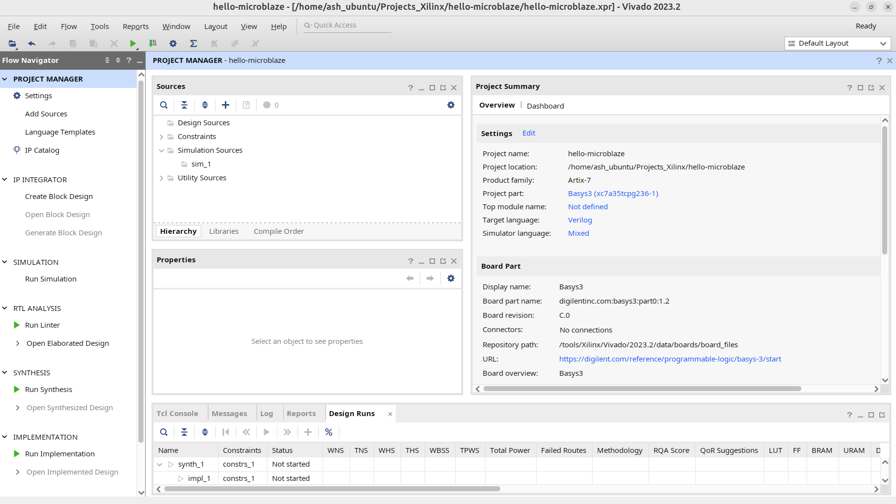
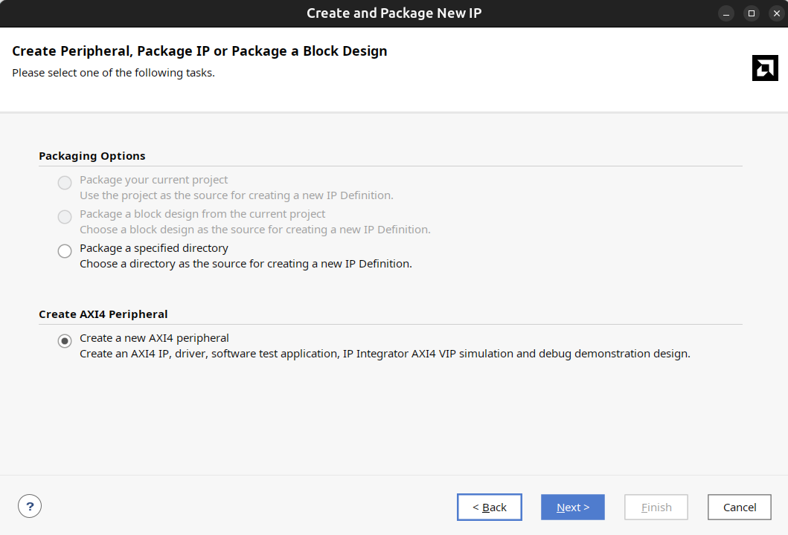
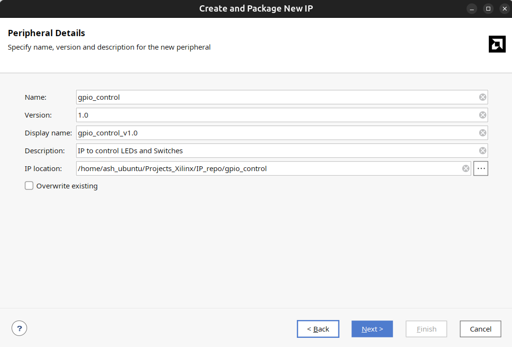
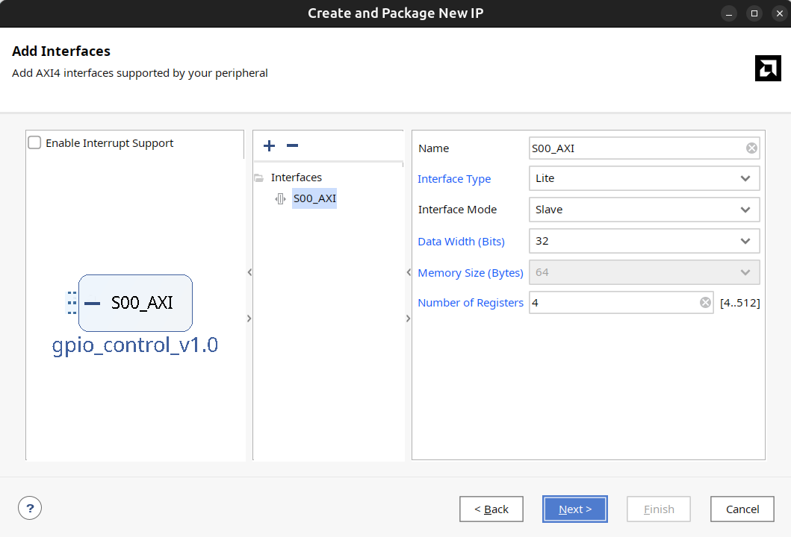

# Custom GPIO IP Core Design in Vivado

## Generating a Custom IP Core using Xilinx Vivado
---

___This is my second repository in github, so any suggestions and feedbacks are welcomed ! 
For connecting with me for future projects, you can connect with [me](https://www.linkedin.com/in/aswinsilicon/)___


---
This project has only one motive. It is to experiment with Custom IP Generation, and thereby try to design an IP for controlling any design switches. I will try to design registers into an IP and will connect them to the pins (external interface) of the IP. This will be subsequently connected to the LEDs on the pole, so that if we want LED, we just need to write it to the register. Here, we are going to use two registers- one for controlling LEDs and the other for the Switches. This project is a primary resource for me to practice, with the open source toolchain and definitely to keep a documentation that is easily understandable by anyone who later tries to practice it the same way. I will keep on updating this repository whenever it is required.

## Overview
This repository documents the process of designing a custom GPIO IP core in Xilinx Vivado for controlling switches and LEDs using the AXI interface. The IP core is customizable and can be integrated into a block design on various FPGA platforms.

The IP manages registers, defines AXI interfaces, and allows parameter customization for hardware-level integration.

Let's Start

---

### NOTE: This repository follows Linux based Operating System. I have used [Ubuntu 24.04.1 LTS](https://ubuntu.com/download/desktop).
#### Make sure all the libraries that are necessary for all these below software are installed in your system. Also this would cost a lot of space as well so I suggest to get atleast 250GB of storage and atleast 8GB RAM.
---

## Contents
- [1. Ubuntu Setup](#1-Ubuntu-Setup)
- [2. Necessary Libraries Installation](#2-Necessary-Libraries-Installation)
- [3. Xilinx Unified Software Setup](#3-Xilinx-Unified-Software-Setup)
 
## 1. Ubuntu Setup
### I would strongly suggest to Dual Boot your system rather than only keeping Ubuntu 24.04.1 LTS on your system.
  - You can follow the procedure shown in this [video](https://www.youtube.com/watch?v=XjQGGLa_Dic).
  - Make sure you have a minimum 16GB Pendrive available with you.

## 2. Necessary Libraries Installation
- Run the following commands one by one after proper installation of Ubuntu 24.04.1 LTS
```
$ sudo apt update
$ sudo apt upgrade-y
$ sudo apt install build-essential
$ sudo apt install libtinfo-dev
$ sudo apt-get install libtinfo5
$ sudo apt install libncurses5
$ sudo ln -s /lib/x86_64-linux-gnu/libtinfo.so.6 /lib/x86_64-linux-gnu/libtinfo.so.5
$ sudo apt-get install putty
```
## 3. Xilinx Unified Software Setup
### I have used 2023.2 version of the Xilinx Unified Software.
### NOTE: Before going for the installation, make sure all the libraries mentioned above (Section 2) are installed properly on your system, else there is a chance that the installer may get hang at the final processing part.
- You can download the Linux Self Extracting Web Installer from this [site](https://www.xilinx.com/support/download/index.html/content/xilinx/en/downloadNav/vitis/2023-2.html)
- I would suggest installing the Vitis Core Development Kit - 2023.2, which is under the section Vitis (SW Developer) tab.
- Once downloaded, note down the name of the installed 'bin' file name. You will need to remember this in order to open the installer through the Ubuntu Terminal.
- In my case, it is 'FPGAs_AdaptiveSoCs_Unified_2023.2_1013_2256_Lin64.bin'.
- Now, open the Ubuntu Terminal and type the following commands to open Linux Self Extracting Web Installer by Xilinx.
```
$ cd $HOME/Downloads
$ chmod u+x FPGAs_AdaptiveSoCs_Unified_2023.2_1013_2256_Lin64.bin
$ sudo ./FPGAs_AdaptiveSoCs_Unified_2023.2_1013_2256_Lin64.bin
```
- ### Note that you need to replace the file name according to your version in order to open the installer.
 - Login with your credentials.
 - Select Vitis among the different options.
 - Click on next.
 - Choose the installation directory where you want to store the files. I would suggest to store in '/tools/Xilinx'.
 - Install.
 - Once installation is complete, we must ensure all our necessary softwares are properly loading. To check, proceed with the following commands on the Ubuntu Terminal:
 - ### Vivado-
   ```
   $ /tools/Xilinx/Vivado/2023.2/bin/vivado
   ```
   - The Vivado home page should look like this.
    
- ### Vitis Unified Software-
   ```
   $ /tools/Xilinx/Vitis/2023.2/bin/vitis
   ```
   - The Uninfied IDE home page should look like this.
   - 
- ### Installing the Development Board Definition in the Vitis Software
  #### I will be using Digilent Basys 3 FPGA Board
 - the github link from where to download the master.zip [file](https://github.com/Digilent/vivado-boards/archive/master.zip)
 - Extract the zip file
 - go to /vivado-boards-master/new/board_files and copy basys3 folder
 - paste the folder to /tools/Xilinx/Vivado/2023.2/data/boards/board_files directory (create a boards_files folder if missing and then paste it)

## 4. What is an IP?
- A pre-designed functional block of logic (like a processor core, memory controller, or arithmetic unit etc) that can be readily added to a design from a library, allowing designers to quickly incorporate complex functionalities without having to build them from scratch.
- It can be customized and integrated into a larger system using the IP Integrator tool.
  ### IP Integrator:
   - This tool within Vivado allows you to visually connect different IP cores on a design canvas, creating complex system designs by interfacing them together. 


---

## Highlights and Summary

### Design Planning
- Create a custom IP to control switches and LEDs.
- Decide on the AXI-Lite slave interface.
- Define register configurations for hardware peripherals.
- Controller handles LED output and switch input.

### Folder and File Structure
- Create a structured folder for HDL source, metadata, and drivers.
- Key files include:
  - `component.xml`: Stores IP metadata.
  - HDL source files: Verilog/VHDL code.
  - Driver files: Test and integration code.
- Use standard naming conventions and interface types.

### IP Metadata and FPGA Compatibility
- Metadata includes vendor, version, library, and target FPGA info.
- Vivado performs compatibility checks.
- AXI interfaces are automatically generated for processor-IP communication.

### Register Management and AXI Read/Write
- Registers use 4-byte address increments.
- Writing to register 0 controls LEDs.
- Reading from register 1 retrieves switch status.
- Base code is customized for LED and switch interaction.

### Source Code Customization and Clean Architecture
- Group registers logically.
- Register 0: LED control (write-only).
- Register 1: Switch status (read-only by processor).
- Update `component.xml` after code changes.

### IP Project Management and Reusability
- Keep project editable during closure.
- Use a dedicated IP repository folder.
- Configure Vivado to recognize user IPs.

### Integration with Block Design and Constraints
- Connect LEDs and switches in block design.
- Synthesize the design.
- Assign pin constraints in `.xdc` file.
- Customize configurations for different boards.

### Parameter Mapping and GUI-Driven Design
- Define LED and switch width parameters.
- Refresh and upgrade IP in block design.
- Regenerate output products.
- Use Vivado GUI for parameter and connection management.

---

## Features of the GPIO Custom IP
- AXI4-Lite Slave Interface
- Two internal registers:
  - Register 0: LED data
  - Register 1: Switch status
- Modular Verilog design
- Parameterizable LED and switch widths
- Integratable into Vivado block design

---

### Vitis IDE
- Xil_Out32(GPIO_BASEADDR + 0x00, 0xAA); // Write LED pattern
- int switch_val = Xil_In32(GPIO_BASEADDR + 0x04); // Read switch status


## 5. Project Procedure
- Open Vivado using the following command in the Ubuntu Terminal:
   ```
   $ /tools/Xilinx/Vivado/2023.2/bin/vivado
   ```
   ### 5.1 (Vivado)
   - In the Quick Start Tab, click on Create Project.
     
   - Give a project name of your choice and specify a directory
     
   - Under default part section click on Boards and search for Basys3.
     
     - #### NOTE: If you could not find, you can also select xc7a35tcpg236-1 part under the Parts section. But I would strongly suggest to download Basys3 Definition Board File (___refer to Section 3 of this readme file___)
   - Click on next until we reach the project dashboard.
     
   - Under the Tools tab, click on Create and Package new IP
     - Under the pop up window, select Create AXI 4 Interface
        
     - Under the Peripheral details, add Name of the IP you need to generate, in my case "gpio_control"
       
     - Under Add Interfaces (IP Configuration) window, you will see various options:
       - Here, our IP is acting as a Slave, so select Slave.
       - As we are creating a simple IP, select interface type as Lite.(this is more than enough for medium level programs, where high performance is not required)
         
       
